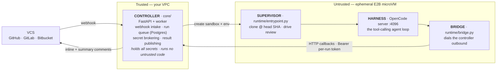
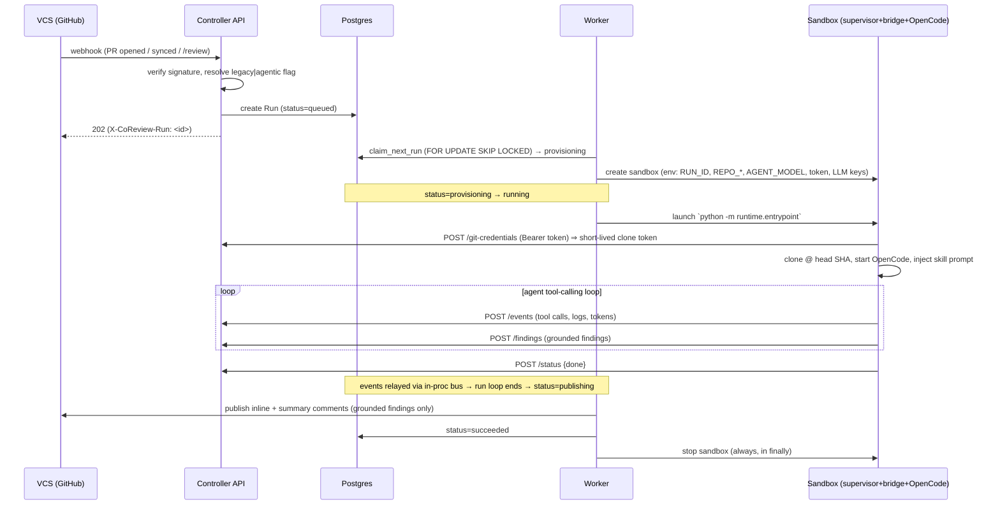

# Architecture

CoReview Agent is a **cloud agent runtime**: a webhook-driven controller that runs a capable coding agent *inside an ephemeral sandbox*, on a real checkout of the code under review, and publishes grounded results back to the source host.

This document is the design record. Read it to understand **why** the pieces are shaped the way they are before you change a seam. The first — and today only — capability is **pull-request review**, but the architecture is deliberately split so that future capabilities (complete-a-PR, deep research, spreadsheet work, …) are added as *bundles* on the same core, not as forks of it.

> **Companion docs**
> - [`README.md`](./README.md) — how to run, test, and deploy.
> - [`.agents/skills/build-pr-review-agent/references/building-a-cloud-agent.md`](./.agents/skills/build-pr-review-agent/references/building-a-cloud-agent.md)
>   — the patterns and rationale in depth, with an honest done-vs-deferred map.
> - [`.agents/skills/build-pr-review-agent/SKILL.md`](./.agents/skills/build-pr-review-agent/SKILL.md)
>   — the from-scratch build sequence.

---

## 1. The thesis: agentic-in-sandbox, not one-shot

A one-shot reviewer stuffs the diff into a single prompt, parses the reply, and posts it. It is context- and verification-starved: it cannot read across files, run a linter, or check a test — so it hallucinates and misses real bugs.

CoReview Agent takes the opposite bet: put a capable model **in a tool-calling loop, on a real checkout, in a sandbox**. It pulls surrounding code on demand, runs linters and tests, and **grounds every finding** against actual file content or command output before reporting it. The agent is limited by model intelligence, not by missing context or tools.

Two design implications run through everything below:

1. **Invest in tools and verification, not bigger prompts.** A finding without evidence is speculation; the `report_finding` contract *requires* a quoted read range or captured command output.
2. **The core knows nothing about "PR review."** It knows about sandboxes, a VCS, a harness, and runs. The review behavior lives entirely in a bundle.

---

## 2. Topology: four roles, two trust zones

Four roles, two trust zones:

- **Controller** (`core/`, trusted): the coordinator and the trust boundary. It verifies webhooks, queues runs, brokers short-lived secrets, and publishes results. It never executes untrusted code.
- **Sandbox** (an E2B Firecracker microVM, untrusted): ephemeral compute holding the checkout and dev tools. It runs the PR author's code, so it is treated as hostile — non-root, ephemeral per run, no long-lived secrets.
- **Supervisor + Bridge** (`runtime/`, in-sandbox glue): the supervisor is PID-1 inside the VM; the bridge is the harness↔controller link. **The bridge dials the controller outbound** — the controller never reaches into the sandbox.
- **Harness** (OpenCode, server-first): the managed agent runtime that runs the actual tool-calling loop. It lives behind an adapter so it can be swapped.

**Why outbound-dial?** A sandbox that only makes outbound calls works through NAT and firewalls and needs no inbound exposure. The single credential it holds is a per-run bearer token scoped to that one run's callbacks — see [§5](#5-trust-boundary--secrets).

**Why a server-first, open-source harness?** You can drive it from any controller, build other clients later, and — crucially — the agent can read the harness's own source to resolve ambiguous behavior instead of guessing it. Don't build a bespoke agent loop; drive a real one behind an adapter.

---

## 3. The request lifecycle

A single review, end to end. Status transitions are the `RunStatus` enum in `core/types.py`; persistence is described in [§6](#6-state--persistence).

The controller-side driver is `core/orchestrator/runner.py::execute_run`. It owns only the **generic** state machine and the trust-boundary operations (provisioning, secret brokering, publishing). It knows nothing about *how* a review is performed — that is the bundle's skill.

**Event relay (the in-process seam).** The bridge POSTs events/findings to the controller's internal API (`core/api/routes/internal.py`). Those handlers `publish()` onto an in-process per-run event bus (`core/orchestrator/bus.py`); the harness adapter's `run()` `subscribe()`s and yields typed `Event`s back to `execute_run` until a terminal `done`/`error`. **This is why the API and worker share a process by default** — the bus is in-memory. To split them into separate tiers, promote the bus to Redis pub/sub; the call sites don't change. (The live-log SSE endpoint in `core/api/routes/runs.py` deliberately polls the `run_events` table instead of the bus, so it works regardless of process layout.)

---

## 4. Core contracts (the seams)

The extension points are all `typing.Protocol`s resolved by small factory functions, so a new provider/harness/bundle drops in **without touching the core**. Keep these contracts free of provider- and harness-specific detail.

| Contract | File | Responsibility |
|---|---|---|
| Data types | `core/types.py` | `TaskSpec`, `RepoRef`, `RunLimits`, `ModelSpec`, `RunStatus` — the shared vocabulary the whole system speaks |
| `VCSProvider` | `core/vcs/base.py` | verify/parse webhook · mint clone token · get PR · publish inline + summary comments |
| `SandboxProvider` | `core/sandbox/provider.py` | create / resume / stop · capability flags · transient-vs-permanent error classification |
| `HarnessAdapter` | `core/harness/base.py` | `runtime_env` (boot config) · `start` · `run` (stream events) · `stop` |
| `Bundle` | `core/bundles.py` | portable MCP/plugin tools · `build_task(trigger) → TaskSpec` · per-harness prompt assets |

Each contract has a factory: `get_vcs_provider(name)`, `get_sandbox_provider()`, `get_harness_adapter(name)`, `get_bundle(name)`. They lazy-import their implementations so importing the package never forces an optional dependency (e.g. the `e2b` or `litellm` SDK) to be installed — important for the dependency-light in-sandbox runtime and for `make compile`.

`TaskSpec` is the pivot: a bundle turns a raw webhook trigger into a harness-agnostic `TaskSpec`, and the orchestrator drives *that* — it never sees the trigger's provider-specific shape.

---

## 5. Trust boundary & secrets

The sandbox runs untrusted PR-author code. The governing rule: **no long-lived secret ever enters the sandbox.**

- **Per-run bearer token.** At create time the controller mints a `SANDBOX_AUTH_TOKEN`
  (`Run.auth_token`) and injects it as the *only* credential the sandbox holds.
  Every `/internal/runs/{id}/...` endpoint authenticates on it
  (`core/api/routes/internal.py::_authed_run`), and it is scoped to that one
  run's callbacks.
- **Brokered git credentials.** Clone/fetch auth is never baked in. Inside the
  sandbox, git is configured to call `runtime/git_credential_helper.py`, which
  POSTs to `/internal/runs/{id}/git-credentials` for a **fresh short-lived token
  per request**. The controller mints it on the trusted side via
  `VCSProvider.mint_clone_token` (a GitHub App installation token scoped to the
  one repo). The helper **refuses to serve credentials unless the request is
  `https` to the run's exact `REPO_HOST`** — so a malicious submodule URL or
  `git ls-remote https://attacker/…` cannot exfiltrate the token — and it never
  falls back to a stale token on failure (a visible failure beats a silent wrong
  credential).
- **Webhook verification fails closed.** Signatures are checked with a
  constant-time HMAC compare *before* the body is parsed; an unconfigured secret
  or a missing/short signature is rejected, never treated as authentic
  (`core/vcs/github.py::_verify_signature`).
- **App identity vs. user identity.** Review is **read + comment as the bot**
  (the App installation token). A future *complete-a-PR* bundle that pushes
  commits or opens PRs attributed to a human must use that **user's OAuth
  token**, not the App's — mixing them would let a user approve their own
  unreviewed code through the bot (a privilege-escalation vector).

**The one acknowledged exposure: LLM keys.** The in-sandbox agent needs an LLM key to call the model, so LLM provider keys (passed via `secret_env`, kept separate from non-secret `env`) genuinely enter the sandbox. This is mitigated by the sandbox's ephemerality and an egress allowlist; the planned hardening is a controller-side LLM proxy so keys never cross the boundary. Until then, treat the gateway key as the blast radius of one ephemeral run.

---

## 6. State & persistence

State lives in **Postgres** (`core/state/`), replacing the Cloudflare Durable Objects of the reference implementation with VPC-native pieces. Four tables (`core/state/models.py`):

- **`runs`** — one row per review: status, repo/PR coordinates, the opaque
  `trigger` payload, the per-run `auth_token`, the provider's native sandbox id,
  and worker-claim bookkeeping (`claimed_at`).
- **`run_events`** — an append-only, sequence-ordered log (tool calls, logs,
  status, findings) that backs the dashboard live-log and post-hoc debugging.
- **`findings`** — structured review findings with a `grounded` flag (evidence
  present) and a `published` flag. **Only grounded findings are published.**
- **`repo_flags`** — per-repo `legacy`|`agentic` override for rollout ([§10](#10-feature-flagged-rollout)).

**Worker claim, not a single writer.** `core/state/repo.py::claim_next_run` uses `SELECT … FOR UPDATE SKIP LOCKED`, so multiple worker processes can pull from the same queue without double-processing — the durable-object single-writer pattern replaced with ordinary row locking.

**Orphan reconciliation.** Completion and wall-clock-timeout logic lives in-process, so a controller restart would otherwise strand an in-flight run as `running` forever (its sandbox is already gone). On boot, `reconcile_orphaned_runs` fails any run left mid-flight. ⚠️ Today this is unconditional, which is safe only for a **single controller replica** — see the known-issues checklist in the README before scaling out.

**Migrations.** `init_db()` auto-creates tables on boot for dev convenience. Production should manage schema with Alembic (already a dependency) and disable auto-create; the migration directory is not scaffolded yet.

---

## 7. VCS providers

GitHub is the primary backend; **GitLab and Bitbucket are day-0** behind the same `VCSProvider` contract (`core/vcs/`). Azure DevOps is planned. Implementations are ported and reshaped from the legacy `../pr-agent` providers, but reduced to the small surface a headless review needs: verify/parse webhook, mint clone token, get PR (metadata + paginated diff), publish inline + summary.

Provider-specific sharp edges worth knowing:

- **GitHub** bundles all inline comments into one review anchored to `head_sha`.
  GitHub rejects the whole review with a 422 if *any* comment's line is outside
  the diff, so on 422 the provider probes each comment individually (via a
  throwaway pending review), re-posts the survivors, and demotes the
  un-anchorable ones into a summary comment so feedback is never silently lost.
- **GitLab / Bitbucket** post per-comment (no bundled review). Bitbucket inline
  anchor placement is best-effort and flagged for validation against a real repo.
- Comment-triggered events (`/review`) often arrive without head/base SHAs; the
  webhook layer enriches the `RepoRef` from the PR API before queuing so the
  sandbox always clones an exact commit.

---

## 8. The sandbox runtime: supervisor + bridge

Everything under `runtime/` runs **inside** the sandbox and ships in a *different* image (`Dockerfile.sandbox`) than the controller. The sandbox boots a **baked template**, so changes here require a template rebuild, not a controller restart.

**Supervisor** (`runtime/entrypoint.py`, PID-1), in order:

1. Install the git credential-helper shim and point git at it.
2. Shallow-clone `REPO_CLONE_URL`, then hard-reset to the exact `REPO_HEAD_SHA`
   (review the precise recorded commit, not a moving tip).
3. Run the repo's `.coreview/setup.sh` hook if present (non-fatal).
4. Build the OpenCode config from the bundle's `opencode.jsonc`: inject the
   resolved provider/model, and stage the bundle's assets into `.opencode/` —
   the `report_finding` plugin tool into `tool/`, the skill into `skills/`, the
   reviewer/critic subagents into `agent/`.
5. Start `opencode serve` and health-check it.
6. Run the **bridge** in-process to drive the review; forward every supervisor
   log line to the controller as a `log` event (the sandbox's stdout is otherwise
   invisible — this is the primary debug surface).
7. Monitor OpenCode with backoff/restart; handle SIGTERM/SIGINT gracefully.

**Bridge** (`runtime/bridge.py`): creates an OpenCode session, opens the `/event` SSE stream *before* injecting the prompt (or the first events are missed), posts the prompt with a monotonically-ascending `messageID`, translates OpenCode message-parts into controller events, and posts a terminal `{status: done}` when the session goes idle. Findings do **not** flow through the bridge — the `report_finding` tool POSTs them straight to the internal API.

> **The OpenCode pin is load-bearing.** OpenCode is pinned to **1.16.2**
> everywhere (`Dockerfile.sandbox`, the bridge, `opencode.jsonc`). Versions 1.14.42–1.15.x
> broke the `/event` SSE endpoint (zero streamed events); 1.16.2 restores it and
> fixes a subagent hang where the parent session never fired `session.idle` after a
> subagent completed. If you bump OpenCode, re-validate the full bridge SSE path.

**Model wiring.** `AGENT_MODEL` uses a `provider/model` form, e.g. `aigateway/MiniMax/MiniMax-M2.7`. The custom `aigateway/` prefix tells the supervisor to wire OpenCode's provider block to the self-hosted OpenAI-compatible gateway (`@ai-sdk/openai-compatible` + `OPENAI_BASE_URL`/`OPENAI_API_KEY`). The same `AGENT_MODEL` is reused by the controller-side LLM service, which rewrites the `aigateway/` prefix to LiteLLM's `openai/` when calling the gateway directly ([§9](#9-capability-bundles) keeps tools portable; model routing is shared so the controller and the in-sandbox agent always agree on the model).

---

## 9. Capability bundles

A bundle specializes the task-agnostic core for one job. It lives under `bundles/<name>/` and contributes:

- **Portable parts** (harness-independent): tool servers/plugins (behavioral
  logic lives here so it ports across harnesses), an output schema (`schema.py`),
  and `build_task(trigger) → TaskSpec`.
- **Per-harness assets**: prompt files under `<harness>/` — for OpenCode, the
  `skill`, the `reviewer`/`critic` subagents, and `opencode.jsonc`.

The `pr_review` bundle implements a **split → fan-out → critic → report** flow, expressed *declaratively in the skill*, not in controller code:

1. The skill reads `git diff base...head` and splits it into independent review
   units.
2. A `reviewer` subagent reviews each unit, pulling surrounding code and running
   linters/tests, producing *candidate* findings with evidence.
3. A `critic` subagent re-verifies every candidate against actual file content /
   command output and **drops anything it cannot independently confirm** or that
   turns out to be pre-existing.
4. Survivors are reported once each via `report_finding`, which POSTs to the
   controller. The controller publishes only grounded findings.

Keeping fan-out declarative in the bundle is what lets the core stay task-agnostic — the harness spawns the subagents; the controller just relays events and publishes results.

---

## 10. Feature-flagged rollout

During migration off the legacy one-shot `../pr-agent`, each repo resolves to a `ReviewMode` — `legacy` (hand off to the standalone pr-agent deployment) or `agentic` (handle here). `core/config/flags.py::resolve_review_mode` checks the `repo_flags` table first, then falls back to the `DEFAULT_REVIEW_MODE` env (default `agentic`). This allows side-by-side A/B rollout and an instant per-repo kill switch back to the proven path. The webhook returns an `X-CoReview-Route: legacy|agentic` header so routing is observable.

---

## 11. Extending the system

Because each seam is a Protocol + factory, extension is additive:

- **Add a VCS provider** — implement `VCSProvider` in `core/vcs/<name>.py`, wire
  it into `get_vcs_provider`, and add a webhook parser. Nothing else changes.
- **Add a harness** (pi-agent, Claude Agent SDK, …) — implement `HarnessAdapter`,
  wire it into `get_harness_adapter`, and port the prompt assets. Tools and core
  are untouched because behavioral logic lives in the bundle's portable tools.
- **Add a sandbox provider** (Modal, Fly, Docker, …) — implement `SandboxProvider`
  with its capability flags and error classification.
- **Add a capability bundle** — create `bundles/<name>/` with `build_task`, a
  schema, tools, and per-harness assets, and register it. The core never imports
  a bundle directly; bundles self-register on import.

The golden rule: **new capability or integration = a new module behind an existing contract, never an edit to the orchestrator.** If you find yourself adding capability-specific logic to `core/orchestrator/`, the abstraction is leaking — push it into a bundle or a provider.

---

## 12. Known limitations & deferred work

Honest map of what is *not* built yet (see the README's "Known issues" checklist for actively-tracked bugs, and `building-a-cloud-agent.md` §9 for the full roadmap):

- **Single-replica reconciliation** — `reconcile_orphaned_runs` fails *all*
  in-flight runs on boot, which is unsafe with more than one controller replica.
  Tracked in the README known-issues checklist.
- **In-process event bus** — API and worker must share a process until the bus is
  promoted to Redis.
- **No heartbeat reaper** — an externally-killed sandbox isn't auto-detected; use
  cancel/restart.
- **Latency optimizations deferred** — no warm pools, snapshot-restore, per-repo
  prebuilt-with-deps images, or warm-on-trigger. Each run is a cold
  template boot + clone.
- **Controller-side LLM proxy deferred** — LLM keys still enter the sandbox
  ([§5](#5-trust-boundary--secrets)).
- **Triage gate deferred** — every triggered PR boots a full sandbox; no cheap
  pre-filter yet.
- **Alembic not scaffolded** — schema is auto-created on boot.

When you pick up any of these, update this section and the companion docs so the map stays honest.
