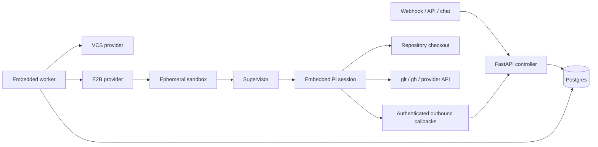

# Architecture

This is the design record for the minimal cloud-agent core. Product principles
live in [VISION.md](VISION.md); setup and operation live in [README.md](README.md).

## Design constraints

1. Repository code executes only in an ephemeral sandbox.
2. The controller coordinates infrastructure; profiles own agent behavior.
3. The sandbox is outbound-only.
4. The agent actuates its own outcomes through ordinary tools.
5. Every meaningful action is observable and persisted.
6. Prefer one explicit path over configurable abstractions without a second use.

## Trust zones and components



The trusted controller contains:

- HTTP trigger and operator APIs;
- Postgres run state and append-only events;
- worker claim coordination;
- VCS token minting;
- sandbox provisioning and teardown.

The untrusted sandbox contains:

- the repository checkout;
- optional repository setup code;
- the selected profile instructions;
- one embedded Pi session;
- short-lived model and SCM credentials for that run.

## Run lifecycle

```mermaid
sequenceDiagram
    participant T as Trigger
    participant C as Controller
    participant D as Postgres
    participant S as E2B sandbox
    participant P as Pi

    T->>C: normalized event or POST /runs
    C->>D: create queued Run
    C->>D: claim with FOR UPDATE SKIP LOCKED
    C->>C: resolve Profile → TaskSpec
    C->>C: subscribe to run event bus
    C->>S: create with task config + scoped secrets
    S->>S: clone exact checkout; optional setup
    S->>P: createAgentSession and prompt
    loop native events
        P->>C: token / tool_call / log
        C->>D: append RunEvent
        C->>C: publish to run event bus
    end
    P->>C: terminal status
    C->>D: mark succeeded or failed
    C->>S: stop sandbox
```

The event subscription is created before sandbox provisioning. This ordering is
load-bearing: a fast session cannot finish before the worker starts listening.

`run_events` is the durable reader source. The in-process bus is control flow
only and is not replayable. API and worker therefore share one process by
default. Splitting them requires a cross-process bus.

## Core contracts

### `TaskSpec`

`TaskSpec` is the pivot between behavior and infrastructure:

- `profile`
- concrete `prompt`
- `RepoRef`
- normalized profile inputs
- run limits

### `Profile`

`Profile.build_task(trigger) -> TaskSpec` is the behavior extension seam.
Profiles may also carry a `SKILL.md` loaded by the sandbox supervisor.

The built-ins:

- `general_agent`
- `pr_review`

The registry uses explicit built-in module mappings. It does not swallow import
errors or depend on registration side effects.

### `SandboxProvider`

Creates and stops isolated compute using a non-secret config plus a separately
identified secret environment. E2B is the current implementation.

### `VCSProvider`

Verifies webhooks, normalizes provider payloads, looks up repositories and pull
requests, and mints short-lived clone/API tokens.

Pi is not a controller contract. It is the sandbox agent engine. A
controller-side adapter would add session lifecycle concepts the controller
cannot actually own and recreate the server glue this architecture removed.

## Sandbox runtime

`runtime/entrypoint.py` is intentionally tiny. It creates
`SandboxSupervisor`, which composes:

- `RuntimeConfig` — immutable environment inputs;
- `Workspace` — credentials, clone, checkout, optional setup;
- `ControlReporter` — best-effort outbound logs and terminal status;
- `pi-runner.mjs` — provider registration, Pi session, native event relay.

The supervisor reads `profiles/<profile>/SKILL.md` when present and prepends it
to `TASK_PROMPT`. A missing skill is valid for free-form profiles.

Pi completion is authoritative. A successful session posts `done`; an exception
posts `error`. Tokens and tool calls are telemetry and never used to infer
completion.

## State

`runs` is the queue and lifecycle record. Workers atomically claim queued rows
with `FOR UPDATE SKIP LOCKED`. Startup reconciliation fails abandoned in-flight
runs after controller restarts.

`run_events` is append-only and sequence-numbered per run. REST and SSE readers
use it for history, replay, and resumption.

The historical `runs.bundle` column is renamed to `runs.profile` by an
idempotent Postgres compatibility migration during initialization.

## Credentials and security

The controller injects:

- a per-run callback bearer token;
- the selected model provider credential;
- a short-lived SCM token and conventional CLI variable names.

Tokens are never returned through controller read APIs or written to event data.
Git stderr is redacted before forwarding.

Sandbox isolation and network policy are the primary security controls.
Credentials still need narrow repository and permission scopes; isolation alone
does not make a broad write token safe.

## Deployment

The controller image contains `core/`, `profiles/`, and `runtime/`. The E2B
image additionally contains Node 22, the pinned Pi package tree, GitHub CLI, and
the one-shot supervisor.

Rebuild the E2B template after changes to runtime code, profiles, the sandbox
Dockerfile, or Pi package locks. Other changes require only a controller
restart.
